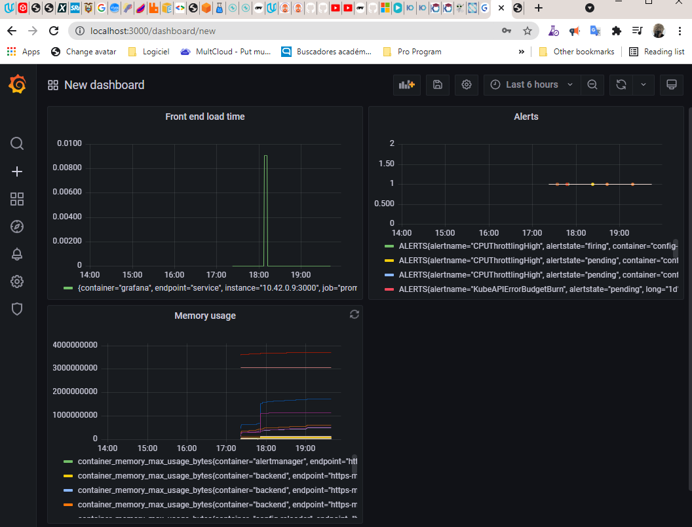

**Note:** For the screenshots, you can store all of your answer images in the `answer-img` directory.

## Verify the monitoring installation

*TODO:* run `kubectl` command to show the running pods and services for all components. Take a screenshot of the output and include it here to verify the installation

## Setup the Jaeger and Prometheus source
*TODO:* Expose Grafana to the internet and then setup Prometheus as a data source. Provide a screenshot of the home page after logging into Grafana.

## Create a Basic Dashboard
*TODO:* Create a dashboard in Grafana that shows Prometheus as a source. Take a screenshot and include it here.

## Describe SLO/SLI
*TODO:* Describe, in your own words, what the SLIs are, based on an SLO of *monthly uptime* and *request response time*.

An SLI (Service Level Indicators) are metrics which indicates if the project achieve the SLO (Service level objectives).
In general, the SLI measure the availability, latency, durability, correctness, throughput, and similars.

### **SLI (Service-level indicators)**
Supposing the following SLOs:
- The service must be 99% uptime every month.
- The request-response time must be less than 5 ms

The SLIs should be:
- How much time in a month the service doesn't respond or is inactive.  
- How much time the 200 requests does it take.
- How much time more than 500 ms is the latency in every response.

## Creating SLI metrics.
*TODO:* It is important to know why we want to measure certain metrics for our customer. Describe in detail 5 metrics to measure these SLIs. 

### **SLI details**
- Traffic, How many 20x HTTP requests are recorded per month.
- Errors, How many 50x and 40x HTTP requests are recorded per month.
- Correctness, What is the percentage under the normal average response time per month.
- Uptime, How many inactive periods the services is unavailable per month.
- Incidents, How many incidents affect the service per month.
- Downtime, How many request can be handled without lose the stability of the service.

## Create a Dashboard to measure our SLIs
*TODO:* Create a dashboard to measure the uptime of the frontend and backend services We will also want to measure to measure 40x and 50x errors. Create a dashboard that show these values over a 24 hour period and take a screenshot.

## Tracing our Flask App
*TODO:*  We will create a Jaeger span to measure the processes on the backend. Once you fill in the span, provide a screenshot of it here.

## Jaeger in Dashboards
*TODO:* Now that the trace is running, let's add the metric to our current Grafana dashboard. Once this is completed, provide a screenshot of it here.
 

## Report Error
*TODO:* Using the template below, write a trouble ticket for the developers, to explain the errors that you are seeing (400, 500, latency) and to let them know the file that is causing the issue.

TROUBLE TICKET

Name: Madai Arteaga

Date: 20/11/2021

Subject: [Error on trial] - Front end and backend

Affected Area: Trial workflow

Severity: High

Description: In the frontend, the secondbutton restuls in status 500

## Creating SLIs and SLOs
*TODO:* We want to create an SLO guaranteeing that our application has a 99.95% uptime per month. Name three SLIs that you would use to measure the success of this SLO.

* Uptime of all services should be greather than 98%
* HTTP status code should be 20x for more than 99.9% of the transactions.
* Average response time to HTTP request be less than 500ms.

## Building KPIs for our plan
*TODO*: Now that we have our SLIs and SLOs, create KPIs to accurately measure these metrics. We will make a dashboard for this, but first write them down here.

* The services (frontend, backend, and trial) should be grather than 98%.
* The average response time of HTTP request should be less than 500ms.
* Percentage of cpu usage less than 70% in core average.
* Percentage of memory usage less tahn 70%.
* Number of HTTP response error 50x should be less than 1%

## Final Dashboard
*TODO*: Create a Dashboard containing graphs that capture all the metrics of your KPIs and adequately representing your SLIs and SLOs. Include a screenshot of the dashboard here, and write a text description of what graphs are represented in the dashboard.  

* cpu
* memory
* service uptime
* Jaeger api tracing